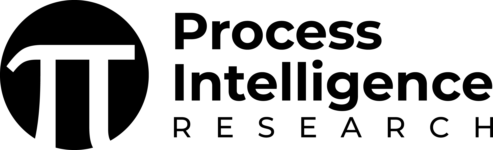

# SFILES 2.0 by [](https://www.pi-research.org/)

## Overview

**SFILES 2.0** is an open-source Python package for converting process flow diagrams (PFDs) and piping and instrumentation diagrams (P\&IDs) into an extended text-based representation. This package is developed in conjunction with the paper:

> *[SFILES 2.0: An extended text-based flowsheet representation](https://link.springer.com/article/10.1007/s11081-023-09798-9)*

The repository provides tools for:

* Representing flowsheets as graphs
* Converting graphs to SFILES 2.0 strings and back
* Demonstrating the notation rules, structure, and conversion algorithm for SFILES 2.0

### Citation

If you use SFILES 2.0 in your work, please cite:

```
@article{vogel2023sfiles,
  title={SFILES 2.0: an extended text-based flowsheet representation},
  author={Vogel, Gabriel and Hirtreiter, Edwin and Schulze Balhorn, Lukas and Schweidtmann, Artur M},
  journal={Optimization and Engineering},
  volume={24},
  number={4},
  pages={2911--2933},
  year={2023},
  publisher={Springer}
}
```

## Table of contents

- [SFILES 2.0 by ](#sfiles-20-by-)
  - [Overview](#overview)
    - [Citation](#citation)
  - [Table of contents](#table-of-contents)
  - [Installation](#installation)
  - [Demonstrations](#demonstrations)
  - [Contributors](#contributors)
  - [License](#license)
  - [Contact](#contact)

## Installation

Install the package via pip:

```bash
pip install SFILES2
```

To explore the source code and examples:

```bash
git clone https://github.com/process-intelligence-research/SFILES2.git
cd SFILES2
pip install .
```

## Demonstrations

Use the following to explore SFILES 2.0 capabilities:

* Run the Jupyter notebook `demonstration.ipynb`
* Or execute `run_demonstration.py` for a CLI-based example

These demonstrate SFILES 2.0 strings for a variety of PFDs and P\&IDs.

## Contributors

| | | |
| --- | --- | --- |
|  | [Gabriel Vogel](https://www.pi-research.org/author/gabriel-vogel/) | <a href="https://www.linkedin.com/in/gabriel-vogel-2512a9212/" rel="nofollow noreferrer">   </a> <a href="https://scholar.google.com/citations?user=9yRGFZMAAAAJ&hl=en" rel="nofollow noreferrer">   </a> |
|  | [Edwin Hirtreiter](https://www.pi-research.org/author/edwin-johann-hirtreiter/) | <a href="https://www.linkedin.com/in/edwin-hirtreiter-4ab3481a5/" rel="nofollow noreferrer">   </a> <a href="https://scholar.google.com/citations?hl=en&user=QURe_SoAAAAJ" rel="nofollow noreferrer">   </a> |
|  | [Lukas Schulze Balhorn](https://www.pi-research.org/author/lukas-schulze-balhorn/) | <a href="https://www.linkedin.com/in/lukas-schulze-balhorn-12a3a4205/" rel="nofollow noreferrer">   </a> <a href="https://scholar.google.com/citations?user=LZZ7piQAAAAJ&hl=en" rel="nofollow noreferrer">   </a> |
|  | [Artur M. Schweidtmann](https://www.pi-research.org/author/artur-schweidtmann/) | <a href="https://www.linkedin.com/in/schweidtmann/" rel="nofollow noreferrer">   </a> <a href="https://scholar.google.com/citations?user=g-GwouoAAAAJ&hl=en" rel="nofollow noreferrer">   </a> |


## License

This project is licensed under the [MIT License](LICENSE).

## Contact

📧 [Contact](mailto:a.schweidtmann@tudelft.nl)

🌐 [Process Intelligence Research](https://www.pi-research.org)

<p align="left">
<a href="https://twitter.com/ASchweidtmann" target="blank"></a>
</p>

<p align="left">
<a href="https://www.linkedin.com/in/schweidtmann/" target="blank"></a>
</p>